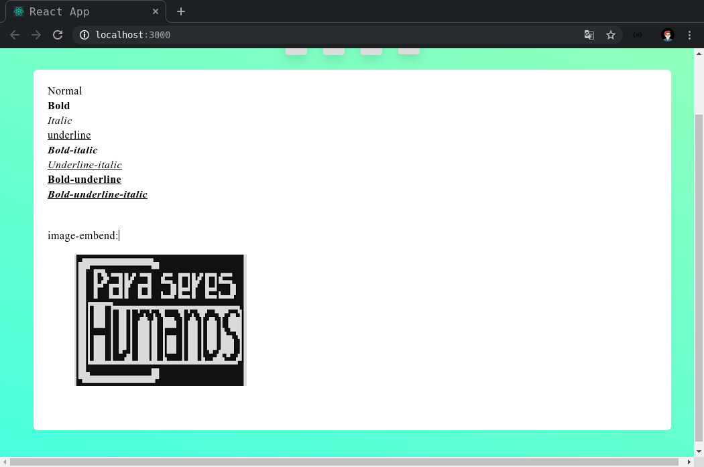

# Simple Text Editor - JavaScript

Is a text editor maked with React and Draft-js.



## Features
- text formatation
- image embend.

# How to launch

Before of more nothing, install the `yarn`.

After run the next commands:

```
$ cd /path/to/SimpleTextEditor-js
$ yarn install
```

And run `yarn start` on directory of the project.
